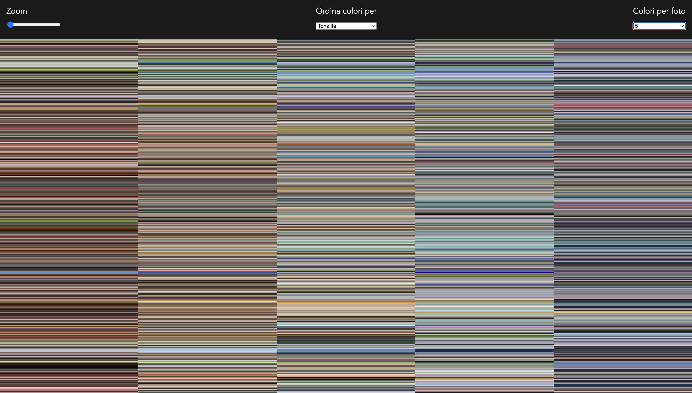
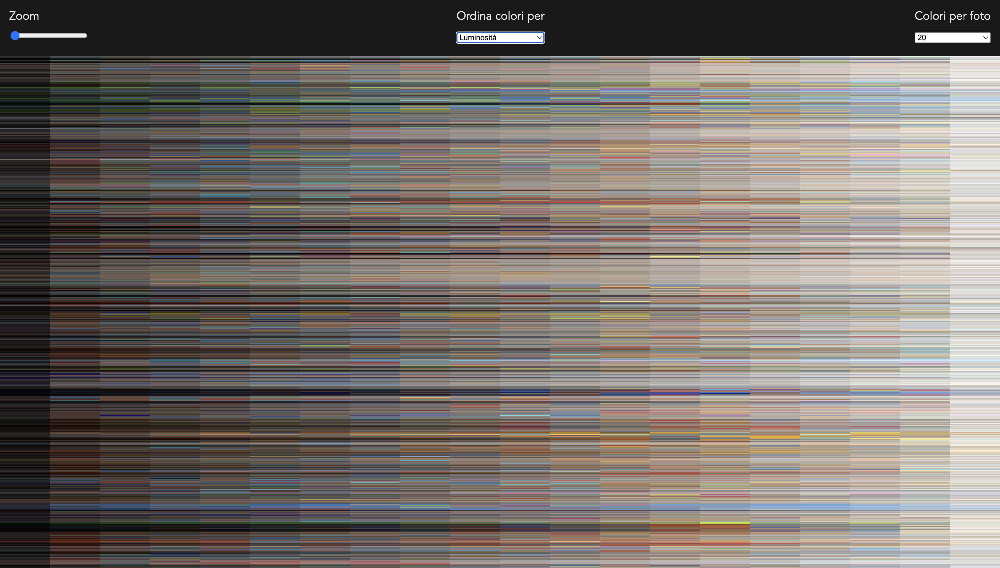
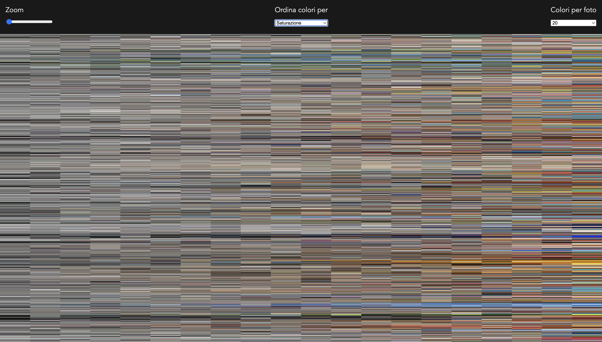

SUPSI 2025  
Corso d’interaction design, CV428.01  
Docenti: A. Gysin, G. Profeta  

Elaborato 1: Archivio

# Photo Colors Viewer
Autore: Anastasia Wiesendanger
[Titolo progetto](https://anastasiawiesendanger.github.io/The_Photo_Colors_Viewer/)

## Introduzione e tema
Questo lavoro è iniziato con le nostre fotografie dentro i nostri telefoni. Lo scopo era quella di creare una specie di archivio fotografico, ma non uno qualunche. Esso poteva essere costruito come volevamo. Poteva essere organizzato in maniera temporale, per soggetto, per contenuto, per colore, etc. Inoltre il modo in cui mostriamo le foto non doveva essere come ad esempio un album fotografico, ma qualcosa di più creativo, astratto anche. 

## Riferimenti progettuali
Per questo progetto ho avuto qualche dubbio su come mostrare il mio lavoro. Vendendo come i volessi reare una specie di compsizione piena di colori, ho pensato un po' a come le foto vengono intrepretate digitalmente, ovvero sottoforma di pixel, ovvero rettangoli.

## Design dell’interfaccia e modalità di interazione
L'interfaccia è costruita in maniera alquanto semplice, su una pagina singola. Ho ordinato i colori delle immagini come una scacchiera per averli vicini e così da poterli confrontare facilmente tra di loro. Vi sono presenti varie opzione che servono a cambiare il modo in cui i colori vengono mostrati, la loro quantità ed anche uno zoom. Inoltre vi è possibile visualizzare la dato passando semplicemente sopra con il mouse.

## Tecnologia usata
Per fare questo lavoro abbiamo utilizzato varie tecnologie come l'exif extract per estraporale i dati informati e il color extract per individuare i colori presenti all'interno delle immagini. Oltre a questi, mi stato particolarmente utile una parte di codice che serve per ordinare i colori in varie maniere come tonalità, saturazione e luminosità:

file.Colors.sort((a, b) => {
                    const hslA = hexToHSL(a);
                    const hslB = hexToHSL(b);
                    switch (order) {
                        case "hue":
                            return hslA.h - hslB.h;
                        case "saturation":
                            return hslA.s - hslB.s;
                        case "light":
                            return hslA.l - hslB.l;
                        default:
                            return a.localeCompare(b);
                    }
                });

 
             

## Target e contesto d’uso
Questo articolo è stato principalmente crearto con l'intenzione di essere mostrato agli studenti che frequentano il Bachelor di Comunicazione Visiva, più specificamente per chi frequenta o vorrà frequentare la classe di Interaction Design. Il siot ha lo scopo principlae di incuriosire l'utente, di mostrare come vi esistono difreneti modi per costruire/mostrare qualcosa oltre che ha mostrare come tramite il codice si possno organizzare numerosi elementi.

